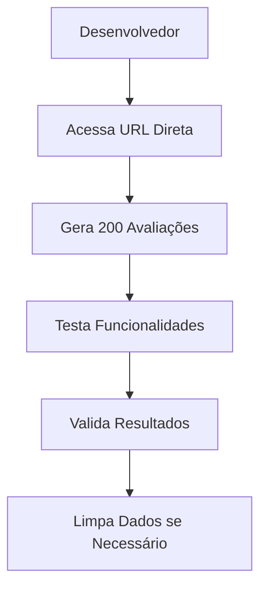

# 🎓 Gerador de Dados Educacionais - Versão Simplificada

## 📋 Visão Geral

Este gerador cria dados de teste essenciais para simular uma escola com 200 avaliações distribuídas em 5 áreas educacionais principais.

## 🚀 Como Usar

### 1. **Acessar o Gerador**
- Navegue diretamente para `/test/generate-education-data` na aplicação
- **Não há menu** - acesso direto via URL

### 2. **Gerar Dados**
- Clique no botão **"🚀 Gerar 200 Avaliações"**
- Aguarde o processo de geração (barra de progresso)
- Confirme a mensagem de sucesso

### 3. **Limpar Dados (Opcional)**
- Use o botão **"🗑️ Limpar Todos os Dados"** para remover tudo
- ⚠️ **ATENÇÃO**: Esta ação não pode ser desfeita!

## 📚 Áreas Educacionais (Simplificadas)

| Área | Descrição |
|------|-----------|
| **Atendimento ao Aluno** | Qualidade do atendimento aos estudantes |
| **Infraestrutura** | Condições físicas da escola |
| **Qualidade do Ensino** | Efetividade dos métodos de ensino |
| **Segurança** | Segurança dentro e ao redor da escola |
| **Limpeza e Higiene** | Manutenção da limpeza e condições sanitárias |

## 📊 Características dos Dados

### **Distribuição de Avaliações**
- **200 feedbacks** distribuídos igualmente entre as áreas
- **40 feedbacks por área**

### **Distribuição de Estrelas (Realista)**
- **70%**: 4-5 estrelas (excelente/ótimo)
- **20%**: 3 estrelas (bom)
- **10%**: 1-2 estrelas (ruim/regular)

### **Comentários**
- **10 comentários simples** e diretos
- **Educacionais e realistas**
- **Distribuídos aleatoriamente**

### **Datas**
- **Últimos 6 meses** (mais recente)
- **Distribuição cronológica** realista

### **Anonimato**
- **80% dos feedbacks são anônimos**
- **20% identificados**

## 🔧 Funcionalidades Técnicas

### **Simplicidade**
- ✅ **Sem menus complexos**
- ✅ **Interface limpa e direta**
- ✅ **Foco no essencial**
- ✅ **Sem dependências desnecessárias**

### **Progresso em Tempo Real**
- 📊 **Barra de progresso** visual
- 📈 **30% para criação de áreas**
- 📈 **70% para geração de feedbacks**

### **Segurança**
- 🔒 **Apenas usuário logado** pode gerar dados
- 🚫 **Confirmação** para exclusão de dados

## 📱 Interface Simplificada

### **Layout**
- 🎯 **Header centralizado** com título claro
- 📱 **Card único** com todas as funcionalidades
- 🔘 **Botões grandes** e fáceis de usar
- 📊 **Progresso visual** durante geração

### **Design**
- 🎨 **Cores padrão** (azul, cinza, branco)
- 📱 **Responsivo** para todos os dispositivos
- ✨ **Animações simples** e eficientes

## 🎯 Casos de Uso

### **1. Desenvolvimento Rápido**
- Testar funcionalidades básicas
- Validar integração com Firebase
- Simular cenários simples

### **2. Demonstrações Simples**
- Mostrar funcionalidade básica
- Apresentar para stakeholders
- Treinar usuários iniciantes

### **3. MVP e Protótipos**
- Validar conceito inicial
- Testar fluxo básico
- Iterar rapidamente

## ⚠️ Considerações

### **Limitações**
- 🚫 **Apenas 5 áreas** (não expansível)
- 🚫 **Comentários fixos** (não personalizáveis)
- 🚫 **Sem categorias** complexas
- 🚫 **Sem análise avançada**

### **Vantagens**
- ✅ **Rápido de implementar**
- ✅ **Fácil de usar**
- ✅ **Sem complexidade desnecessária**
- ✅ **Foco no essencial**

## 🔄 Fluxo de Trabalho

## 🛠️ Manutenção

### **Arquivos do Sistema**
- `src/app/test/generate-education-data/page.tsx` - Página simplificada
- `GERADOR_DADOS_EDUCACIONAIS.md` - Esta documentação

### **Dependências Mínimas**
- Firebase Firestore para armazenamento
- React Hooks básicos
- Tailwind CSS para estilização

### **Personalização Limitada**
- **Áreas**: Modificar array `educationAreas`
- **Comentários**: Modificar array `comments`
- **Distribuição**: Ajustar função `generateRandomRating`

## 📞 Suporte

Para dúvidas ou problemas:
- 📧 **Email**: suporte@pesquisou.com.br
- 🐛 **Issues**: Reporte bugs no repositório
- 📚 **Documentação**: Consulte esta documentação

---

**Versão**: 2.0.0 (Simplificada)  
**Última Atualização**: $(date +%d/%m/%Y)  
**Status**: ✅ Implementado e Simplificado  
**Filosofia**: 🎯 **Foco no essencial, sem complexidade desnecessária**
