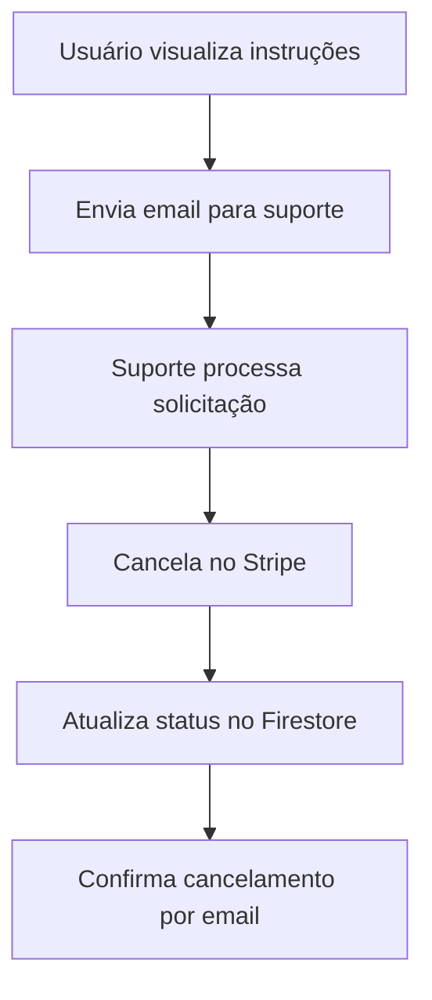

# 💳 Gestão Simplificada de Assinaturas

## 🎯 Visão Geral

O sistema agora possui uma **gestão simplificada de assinaturas** que permite aos usuários:

- ✅ **Visualizar** plano atual e status
- ✅ **Cancelar** assinatura via solicitação por email
- ❌ ~~Atualizar plano (upgrade/downgrade)~~ - Removido
- ❌ ~~Acessar portal do Stripe~~ - Removido
- ❌ ~~Ver histórico de pagamentos~~ - Removido

## 🗂️ Estrutura de Arquivos

### Páginas
- `src/app/assinatura/page.tsx` - Página principal de visualização
- `src/app/pricing/page.tsx` - Página de planos (já existia)

### APIs
- `src/app/api/cancel-subscription/route.ts` - Cancelar assinatura
- `src/app/api/create-checkout-session/route.ts` - Criar sessão (já existia)
- `src/app/api/webhook/route.ts` - Webhooks (já existia)

### Componentes
- `src/components/Sidebar.tsx` - Menu atualizado com link para assinatura

## 🎨 Interface do Usuário

### Página de Visualização de Assinatura (`/assinatura`)

#### Seções Principais:

1. **📊 Plano Atual**
   - Nome do plano
   - Preço mensal
   - Features incluídas
   - Status da assinatura

2. **📋 Informações da Assinatura**
   - Data de ativação do plano
   - Tipo de plano

3. **📧 Cancelar Assinatura**
   - Instruções para cancelamento por email
   - Email de suporte: suporte@pesquisou.com.br
   - Informações necessárias para o cancelamento

## 🔄 Fluxos de Gestão

### 1. **Cancelamento de Assinatura**

## 🛡️ Segurança e Validações

### Validações Implementadas:

1. **Autenticação**: Todas as páginas verificam se o usuário está logado
2. **Autorização**: Usuário só pode visualizar sua própria assinatura

## 📧 Processo de Cancelamento

### Como Cancelar:

1. **Acesse** a página de assinatura (`/assinatura`)
2. **Visualize** as instruções de cancelamento
3. **Envie email** para `suporte@pesquisou.com.br`
4. **Inclua** as seguintes informações:
   - Nome completo
   - Email da conta
   - Motivo do cancelamento (opcional)
   - Data desejada para o cancelamento

### Importante:

- O cancelamento será processado até o final do período atual de cobrança
- Não há cobranças retroativas
- O acesso ao sistema permanece ativo até a data de cancelamento

## 🔧 Manutenção

### APIs Removidas:

- ~~`/api/update-subscription`~~ - Atualização de plano
- ~~`/api/create-portal-session`~~ - Portal do Stripe
- ~~`/api/update-subscription-status`~~ - Atualização de status
- ~~`/api/check-user-subscription`~~ - Verificação de dados
- ~~`/api/fix-subscription-data`~~ - Correção de dados

### Motivo da Simplificação:

- **Redução de complexidade** no sistema
- **Foco na experiência do usuário** com funcionalidades essenciais
- **Processo manual controlado** para cancelamentos
- **Menor manutenção** de código e APIs

## 📱 Responsividade

A interface é totalmente responsiva e funciona em:
- ✅ Desktop
- ✅ Tablet
- ✅ Mobile

## 🎨 Design System

Utiliza o mesmo design system do resto da aplicação:
- Cores consistentes
- Componentes reutilizáveis
- Tipografia padronizada
- Espaçamentos uniformes
