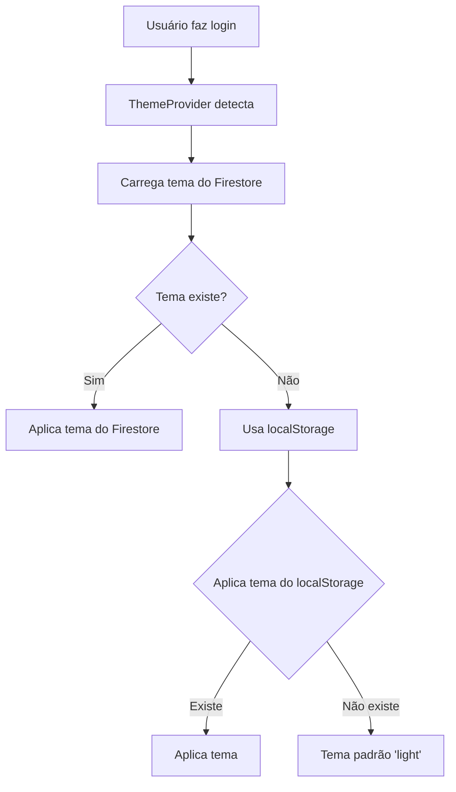
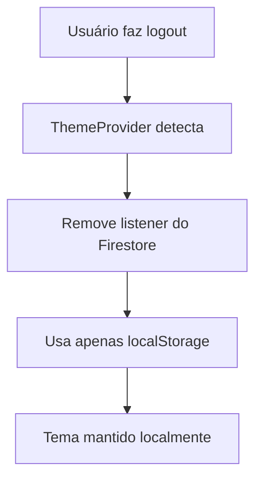

# 🎨 Sistema de Temas - Pesquisou

## 📋 **Visão Geral**

O sistema de temas foi completamente reestruturado para funcionar corretamente com persistência no Firestore e sincronização entre dispositivos.

## 🔧 **Componentes Principais**

### **1. ThemeProvider (`src/components/ThemeProvider.tsx`)**

**Funcionalidades:**
- ✅ Carrega tema do usuário do Firestore quando logado
- ✅ Fallback para localStorage quando não logado
- ✅ Sincronização automática com mudanças de autenticação
- ✅ Aplicação automática do tema no HTML

**Fluxo de Carregamento:**
```typescript
1. Usuário logado → Carrega do Firestore
2. Tema não encontrado → Usa localStorage
3. localStorage vazio → Tema padrão 'light'
4. Erro no Firestore → Fallback para localStorage
```

### **2. ThemeSwitcher (`src/components/ThemeSwitcher.tsx`)**

**Funcionalidades:**
- ✅ Alterna entre temas light/dark
- ✅ Salva automaticamente no Firestore (usuário logado)
- ✅ Salva no localStorage (qualquer situação)
- ✅ Interface visual com ícones

### **3. Profile Page (`src/app/profile/page.tsx`)**

**Funcionalidades:**
- ✅ Toggle de tema integrado ao perfil
- ✅ Salva preferência no Firestore
- ✅ Feedback visual de sucesso/erro
- ✅ Sincronização com ThemeProvider

## 🗄️ **Estrutura de Dados**

### **Campo `theme` no Firestore:**
```typescript
// src/types/User.ts
export interface User {
  uid: string;
  email: string;
  displayName?: string;
  theme?: 'light' | 'dark'; // ✅ Preferência de tema
  // ... outros campos
}
```

### **LocalStorage:**
```javascript
// Chave: 'theme'
// Valor: 'light' | 'dark'
localStorage.setItem('theme', 'dark');
```

## 🔄 **Fluxo de Funcionamento**

### **1. Login do Usuário:**


### **2. Mudança de Tema:**
```mermaid
graph TD
    A[Usuário clica no toggle] --> B[setTheme() chamado]
    B --> C[Aplica tema no HTML]
    C --> D[Salva no localStorage]
    D --> E{Usuário logado?}
    E -->|Sim| F[Salva no Firestore]
    E -->|Não| G[Apenas localStorage]
    F --> H[Feedback de sucesso]
    G --> I[Pronto]
```

### **3. Logout:**


## 🎯 **Regras de Prioridade**

### **Ordem de Carregamento:**
1. **Firestore** (usuário logado)
2. **localStorage** (fallback)
3. **Tema padrão** ('light')

### **Ordem de Salvamento:**
1. **localStorage** (sempre)
2. **Firestore** (se usuário logado)

## 🛠️ **Implementação Técnica**

### **ThemeProvider - Carregamento:**
```typescript
const loadUserTheme = async (currentUser: User) => {
  try {
    const userDoc = await getDoc(doc(db, 'users', currentUser.uid));
    
    if (userDoc.exists()) {
      const userData = userDoc.data();
      const userTheme = userData.theme as Theme;
      
      if (userTheme) {
        applyTheme(userTheme);
        localStorage.setItem('theme', userTheme);
        return;
      }
    }
    
    // Fallback para localStorage
    const savedTheme = localStorage.getItem('theme') as Theme;
    const initialTheme = savedTheme || 'light';
    applyTheme(initialTheme);
    
  } catch (error) {
    // Fallback em caso de erro
    const savedTheme = localStorage.getItem('theme') as Theme;
    const initialTheme = savedTheme || 'light';
    applyTheme(initialTheme);
  }
};
```

### **Salvamento no Firestore:**
```typescript
const handleThemeChange = async (newTheme: 'light' | 'dark') => {
  setTheme(newTheme);
  
  if (user) {
    try {
      await updateDoc(doc(db, 'users', user.uid), {
        theme: newTheme,
        updatedAt: new Date()
      });
    } catch (error) {
      console.error('Erro ao salvar tema:', error);
    }
  }
};
```

## 🎨 **Classes CSS Utilizadas**

### **Tailwind CSS:**
- `dark:` - Variantes para modo escuro
- `bg-white dark:bg-gray-800` - Fundos
- `text-gray-900 dark:text-white` - Textos
- `border-gray-200 dark:border-gray-700` - Bordas

### **Aplicação no HTML:**
```typescript
const applyTheme = (newTheme: Theme) => {
  const html = document.documentElement;
  
  if (newTheme === 'dark') {
    html.classList.add('dark');
  } else {
    html.classList.remove('dark');
  }
};
```

## ✅ **Funcionalidades Implementadas**

- [x] **Carregamento automático** do tema do usuário
- [x] **Persistência no Firestore** para usuários logados
- [x] **Fallback para localStorage** quando não logado
- [x] **Sincronização entre dispositivos** (via Firestore)
- [x] **Interface visual** com toggle e ícones
- [x] **Feedback de sucesso/erro** ao salvar
- [x] **Tratamento de erros** robusto
- [x] **Performance otimizada** com listeners

## 🚀 **Como Usar**

### **Para Desenvolvedores:**
```typescript
import { useTheme } from '@/components/ThemeProvider';

function MyComponent() {
  const { theme, setTheme } = useTheme();
  
  return (
    <div className="bg-white dark:bg-gray-800">
      <button onClick={() => setTheme('dark')}>
        Modo Escuro
      </button>
    </div>
  );
}
```

### **Para Usuários:**
1. **Login** no sistema
2. **Acessar perfil** (/profile)
3. **Clicar no toggle** de tema
4. **Preferência salva** automaticamente
5. **Tema sincronizado** em todos os dispositivos

## 🔍 **Debug e Monitoramento**

### **Logs do Console:**
- `🔧 ThemeProvider: Carregando tema do usuário: [uid]`
- `🔧 ThemeProvider: Tema encontrado no Firestore: [tema]`
- `🎨 Tema salvo no Firestore: [tema]`
- `Erro ao salvar tema no Firestore: [erro]`

### **Verificação Manual:**
1. **Firestore:** Coleção `users` → Documento do usuário → Campo `theme`
2. **localStorage:** `localStorage.getItem('theme')`
3. **HTML:** `document.documentElement.classList.contains('dark')`

---

**🎯 Sistema de temas totalmente funcional e sincronizado!**
